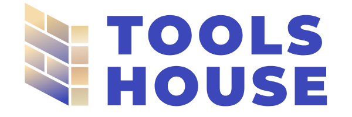

 

  

  <h3 align="center">Tools House</h3>

  

    Renta herrmaientas y objetos para el hogar.
     
    <a href="/"><strong>Visitar la pagina »</strong></a>
     
  

## Acerca De

Somos el equipo 2 del proyecto integrador CTD2024. La pagina es una simulacion de una empresa que renta herramientas y equipo vario para hogar. El usuario es capaz de crear una cuenta, y rentar los productos que quiera en las fechas que estan disponibles. El admin tiene la capacidad de crear dentro del dashboard los productos, fijar su informacion como las caracteristicas y darle permisos de admin a los usuarios que desee.   

### Construido con:

- React + Tailwind para el FrontEnd
- Java y SQL para el Backend
- La comunicacion entre los dos es mediante REST Apis.
   

 

## Equipo

Creado por: Jorge Leves, Angel Gutiérrez, Wendy Garcia, Leidy Montero, Gonzalo Martinez, Giovanni Favaloro, Joaquin Errasti, Breno Lasserre, Fernando Fitipaldo y Nicolas Alvarez
  

(<a href="#readme-top">Volver Arriba</a>)

